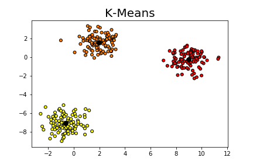

# Machine Learning Algorithms Implemented from Scratch

In this repository, you can find the implementation of Machine Learning Algorithms from scratch. The aim of this project is to understand the fundamentals of the algorithms.

You can find a comparison with the popular ML/DL libraries [Scikit-Learn](https://scikit-learn.org/stable/) and [Keras](https://keras.io/). 

## Supervised Learning

* [Decision Tree](https://github.com/snnclsr/ML_from_scratch/blob/master/decision_tree.ipynb)
* [Elastic Net](https://github.com/snnclsr/ML_from_scratch/blob/master/elastic_net.ipynb)
* [Gradient Boosting Machine](https://github.com/snnclsr/ML_from_scratch/blob/master/gbm.ipynb)
* [K-Nearest Neighbor](https://github.com/snnclsr/ML_from_scratch/blob/master/knn.ipynb)
* [Lasso Regression](https://github.com/snnclsr/ML_from_scratch/blob/master/lasso_regression.ipynb)
* [Linear Regression](https://github.com/snnclsr/ML_from_scratch/blob/master/linear_regression.ipynb)
* [Logistic Regression](https://github.com/snnclsr/ML_from_scratch/blob/master/logistic_regression.ipynb)
* [Naive Bayes](https://github.com/snnclsr/ML_from_scratch/blob/master/naive_bayes.ipynb)
* [Neural Networks](https://github.com/snnclsr/ML_from_scratch/blob/master/neural_networks.ipynb)
* [Perceptron](https://github.com/snnclsr/ML_from_scratch/blob/master/perceptron.ipynb)
* [Polynomial Regression](https://github.com/snnclsr/ML_from_scratch/blob/master/polynomial_regression.ipynb)
* [Random Forest](https://github.com/snnclsr/ML_from_scratch/blob/master/random_forest.ipynb)
* [Ridge Regression](https://github.com/snnclsr/ML_from_scratch/blob/master/ridge_regression.ipynb)

## Unsupervised Learning

* [DBSCAN](https://github.com/snnclsr/ML_from_scratch/blob/master/dbscan.ipynb)
* [K-Means](https://github.com/snnclsr/ML_from_scratch/blob/master/k_means.ipynb)
* [PCA](https://github.com/snnclsr/ML_from_scratch/blob/master/pca.ipynb)

# Examples

---------------------

---------------------

---------------------

---------------------

---------------------

---------------------

# REFERENCES

**Please check out the [REFERENCES](REFERENCES.md) file.**

